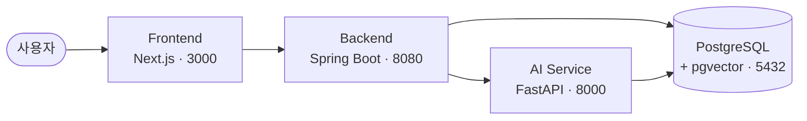
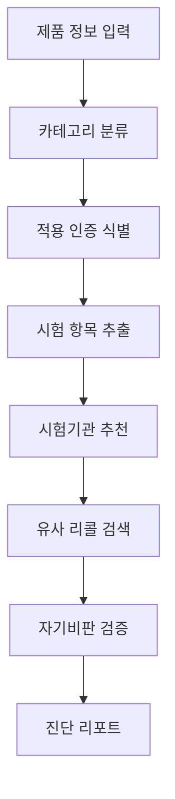

# KCpilot 🔌

> **KC 인증 사전진단 AI 서비스** — 제품 정보를 자연어로 입력하면 *어떤 KC 인증이 필요한지* 30초 안에 법령 근거와 함께 리포트로 정리해준다.

> 🎥 **데모** — _시연 화면/GIF 추가 예정_

---

## 🎯 해결하는 문제

중소기업 인증 실태조사(중소기업중앙회) 기준, KC 인증의 진입장벽은 수치로 입증돼 있다.

- 인증 **비용** 부담 `44.3%` · **절차** 부담 `35.0%` · **기간** 부담 `31.6%`
- 인증 취득 **실패·포기 1순위 사유** = _"까다로운 취득 절차"_ `29.8%`

그런데 기존 수단에는 빈틈이 있다.

- 정부 `safetykorea.kr` → **이미 인증된 제품을 검색**하는 시스템. 미인증 제품에 *무엇이 필요한지*는 알려주지 않는다.
- 사설 컨설팅 → 건당 수십~수백만원. 영세 제조사·스타트업에 부담.
- ChatGPT → 복수 인증을 자주 누락하고 **출처가 없다**.

**KCpilot은 "이 제품에 무엇이 필요한가"를 법령 근거와 함께 진단한다.**

## ✨ 핵심 기능 & 차별점

|  | safetykorea | 사설 컨설팅 | ChatGPT | **KCpilot** |
|---|:---:|:---:|:---:|:---:|
| 인증 종류 자동 진단 | ❌ | ✅ | △ | ✅ |
| 자연어 입력 | ❌ | ✅ | ✅ | ✅ |
| **복수 인증 동시 식별** | ❌ | ✅ | ❌ | ✅ |
| 리콜 사례 사전 경고 | ❌ | △ | ❌ | ✅ |
| 출처 법령 명시 | △ | ✅ | ❌ | ✅ |
| 비용 | 무료 | 수십~수백만원 | 무료 | 무료~저가 |

> 가장 결정적인 차별점은 **복수 인증의 동시 식별**이다. 헤어드라이어처럼 *안전인증 + 전자파 인증*이 동시에 걸리는 케이스를 누락 없이 잡아낸다 — ChatGPT·검색이 가장 자주 틀리는 지점이다.

## 🎬 시연 시나리오

- **헤어드라이어** → 안전인증 + 전자파 적합등록 *(복수 인증 동시)*
- **어린이 전자완구** → 어린이제품 + 전기용품 *(이중 카테고리)*, 환경호르몬·질식 위험 경고
- **산업용 IoT 센서** → 모호 케이스, 단정 대신 *전문가 상담 유도*

## 🏗️ 아키텍처



AI 진단은 LangGraph 기반 멀티스텝 워크플로우로 동작한다.



## 💡 기술적 도전 — "AI가 그럴듯하게 지어내는 것" 막기

신뢰성이 이 서비스의 생명이다. 거짓 자신감을 차단하기 위한 설계:

- **RAG 기반 근거 강제** — 모든 진단은 검색된 법령 텍스트에 근거한다. 법령에 없는 내용 생성 금지, 출처 조항을 명시한다.
- **신뢰도 Hybrid 산출** — 독립적인 두 신호를 *보수적으로* 결합한다:
  ```
  confidenceScore = MIN(ragScore, llmScore)
  ```
  RAG 유사도(객관적 신호)와 LLM 자기평가(맥락 신호) 중 **낮은 값**을 채택 → 한쪽이라도 의심하면 신뢰도를 낮춰 거짓 자신감을 막는다.
- **자기비판 노드** — LangGraph 워크플로우에 1차 결론을 재검토하는 노드를 둔다.
- **인증별 신뢰도 라벨** — 진단 전체를 단일 점수로 뭉개지 않고 인증마다 `HIGH`/`MEDIUM`/`LOW`. 백분율은 노출하지 않는다 (calibration이 보장 안 된 숫자가 주는 *거짓 정밀성* 회피).

## 🛠️ 기술 스택

| 영역 | 기술 |
|------|------|
| **Frontend** | Next.js 15 (App Router), React 19, TypeScript, Tailwind CSS |
| **Backend** | Spring Boot 3.5 (Java 21), JPA, Spring Security + JWT |
| **AI** | FastAPI (Python 3.11), LangChain / LangGraph, OpenAI |
| **Data** | PostgreSQL 18 + pgvector (RAG 임베딩 검색) |
| **Infra** | Docker Compose |

## 🚀 로컬 실행

> 사전 요구사항: **Docker**, **JDK 21**, **Node.js 22**, **[uv](https://docs.astral.sh/uv/)** _(Python 3.11은 uv가 자동 설치)_

```bash
# 1. 클론 & 환경변수 파일 생성
git clone <repository-url> && cd kcpilot
cp .env.example .env
cp ai-service/.env.example ai-service/.env
cp backend/src/main/resources/application-local.yaml.example \
   backend/src/main/resources/application-local.yaml

# ↑ 생성된 파일 3개를 각자 환경에 맞게 편집한 뒤 진행

# 2. DB 기동 (PostgreSQL + pgvector)
docker-compose up -d

# 3. 세 서비스 실행 (각각 별도 터미널)
cd backend    && ./gradlew bootRun                            # :8080
cd ai-service && uv sync && uv run uvicorn main:app --reload  # :8000
cd frontend   && npm install && npm run dev                   # :3000
```

확인: <http://localhost:8000/ai/health> → `{"status":"ok"}` · API 문서 <http://localhost:8000/docs>

<details>
<summary><b>상세 설정 · 기본 자격증명 · 테스트</b></summary>

### 환경변수

- **루트 `.env`** — `POSTGRES_USER` / `POSTGRES_PASSWORD`. docker-compose가 이 값으로 PostgreSQL 컨테이너를 생성한다.
- **`backend/.../application-local.yaml`** — Spring Boot 로컬 DB 연결 설정. `.env`의 `POSTGRES_USER` / `POSTGRES_PASSWORD`와 반드시 일치해야 한다.
- **`ai-service/.env`** — `OPENAI_API_KEY`. (현재 OpenAI 연동 전이라 비워둬도 서버는 실행된다)

### Docker

```bash
docker-compose down       # 중지
docker-compose down -v    # 볼륨까지 제거 (init 스크립트 재실행 시)
```

첫 기동 시 `infra/postgres/init/01-init.sql`이 자동 실행되어 `CREATE EXTENSION vector`가 적용된다. Windows는 `./gradlew` 대신 `gradlew.bat`.

### 기본 자격증명 (개발용)

`.env`와 `application-local.yaml.example`에 설정된 기본값이다.

| 대상 | 사용자 | 비밀번호 |
|------|--------|----------|
| PostgreSQL (DB: `kcpilot`) | `hamin` | `1234` |
| backend (Spring Security) | `admin` | `admin` |

> ⚠️ 로컬 개발 전용이다. 두 파일 모두 gitignore되어 있어 저장소에 올라가지 않는다.

### 테스트

```bash
cd backend    && ./gradlew test     # backend
cd frontend   && npm test           # frontend
cd ai-service && uv run pytest      # ai-service
```

</details>

## 📍 현재 상태

초기 스캐폴드 단계다.

- backend ↔ ai-service 연동 미구현 (ai-service의 `POST /ai/run-assessment`는 placeholder)
- frontend는 초기 App Router 스캐폴드

## 📚 더 보기

- 요구사항 정의서: [docs/requirements.md](docs/requirements.md)
- 서비스별 개발 가이드: [backend](backend/CLAUDE.md) · [frontend](frontend/CLAUDE.md) · [ai-service](ai-service/CLAUDE.md)
- 커밋·브랜치 규칙: [docs/git_convention.md](docs/git_convention.md)
